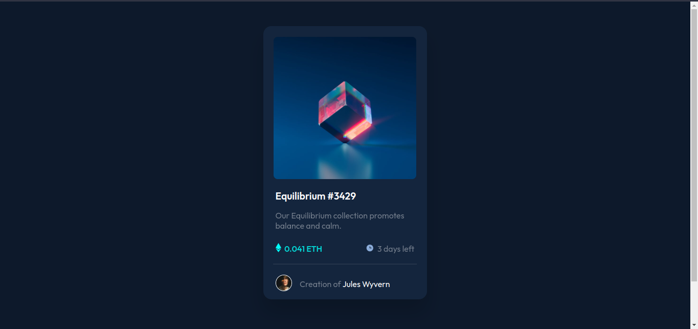

# Frontend Mentor - NFT preview card component solution

This is a solution to the [NFT preview card component challenge on Frontend Mentor](https://www.frontendmentor.io/challenges/nft-preview-card-component-SbdUL_w0U). Frontend Mentor challenges help you improve your coding skills by building realistic projects. 

## Table of contents

- [Frontend Mentor - NFT preview card component solution](#frontend-mentor---nft-preview-card-component-solution)
  - [Table of contents](#table-of-contents)
  - [Overview](#overview)
    - [The challenge](#the-challenge)
    - [Screenshot](#screenshot)
    - [Links](#links)
  - [My process](#my-process)
    - [Built with](#built-with)
    - [What I learned](#what-i-learned)
    - [Continued development](#continued-development)
    - [Useful resources](#useful-resources)
  - [Author](#author)

**Note: Delete this note and update the table of contents based on what sections you keep.**

## Overview

### The challenge

Users should be able to:

- View the optimal layout depending on their device's screen size
- See hover states for interactive elements

### Screenshot

### Links

- Solution URL: [Link](https://github.com/prakhartiwari0/nft-preview-card)
- Live Site URL: [Link](https://www.heyprakhar.xyz/nft-preview-card/)

## My process

### Built with

- HTML5 markup
- CSS3
- Flexbox

### What I learned

I learnt how to make a project with assets. I learnt some css properties and techniques to add various effects. I also practically used my skills and learnt how to write less code by using same classes on elements that have the same properties. 

### Continued development

I need to learn css in depth, and practice a lot more. I also have to learn css grid concept.

### Useful resources

- [Hover effect tutorial](https://youtu.be/exb2ab72Xhs) -This tutorial helped me make the hover effect part, I was not sure how to make that, I had some idea but wanted some clarification and know what other people are doing.

## Author

- Website - [Prakhar Tiwari](https://www.heyprakhar.xyz)
- Frontend Mentor - [@prakhartiwari0](https://www.frontendmentor.io/profile/prakhartiwari0)
- Twitter - [@prakhartiwari0](https://www.twitter.com/prakhartiwari0)